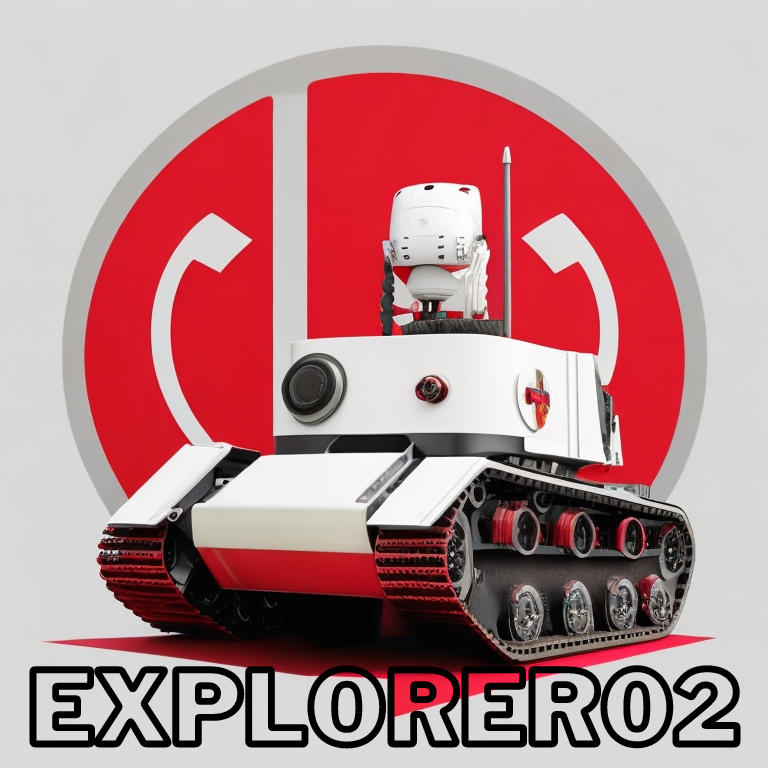
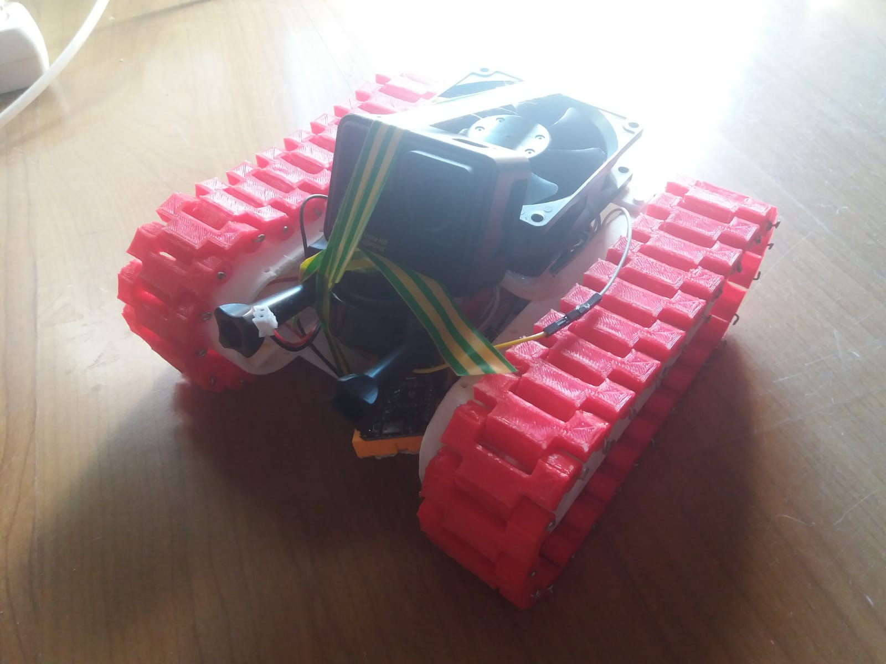

# ESP8266-EXPLORER02
Robot tank design printed on a 3D printer, controlled via access point and incorporated Web page, using an ESP8266, an H bridge with two batteries, one with 3 18650 batteries to power the H bridge and the four generic motors, and the other with 3v for the ESP8266

Project developed using an ESP8266, Arduino IDE and a device capable of connecting to Wifi and viewing Web pages (Computer/Smartphone)

## Index

- [Overview](#Overview)
- [Configuration](#Configuration)
- [How it works](#How-it-works)
- [Possible future improvements](#Possible-future-improvements)

## Overview
Robot tank design printed on a 3D printer, controlled via access point and incorporated Web page, using an ESP8266, an H bridge with two batteries, one with 3 18650 batteries to power the H bridge and the four generic motors, and the other with 3v for the ESP8266, its purpose was to walk on the street, or at home as a spy, however as it makes some noise, its purpose became accessing and filming difficult to access sites. It is all done in the 3d printer, made with a model of <a href ="https://www.thingiverse.com/thing:2527319">Thingerverse</a> the tank is able to travel outdoors at great speed, due to the battery consisting of three 18650. **The Project has WiFi and own dashboard**

Robot V2:

## Configuration
-> Print 3D PARTS 
-> Build the Robot 
-> Install Arduino IDE 
-> <a href ="https://www.makerhero.com/blog/programar-nodemcu-com-ide-arduino/">Configure your Arduino IDE to ESP8266</a> 
-> Choose the correct COM port 
-> Upload the code to ESP82666 

## How it works
- Press middle button to stop and receive new direction 
- Press front button to drive to front 
- Press back button to drive to rear 
- Press left button to rotate left 
- Press right button to rotate right 
**Note: If you press the same button several times, it will move in the same direction, more faster.**

Dashboard view: 

## Possible future improvements
Add a laser or LEDs, a Go Pro, or a shooter
